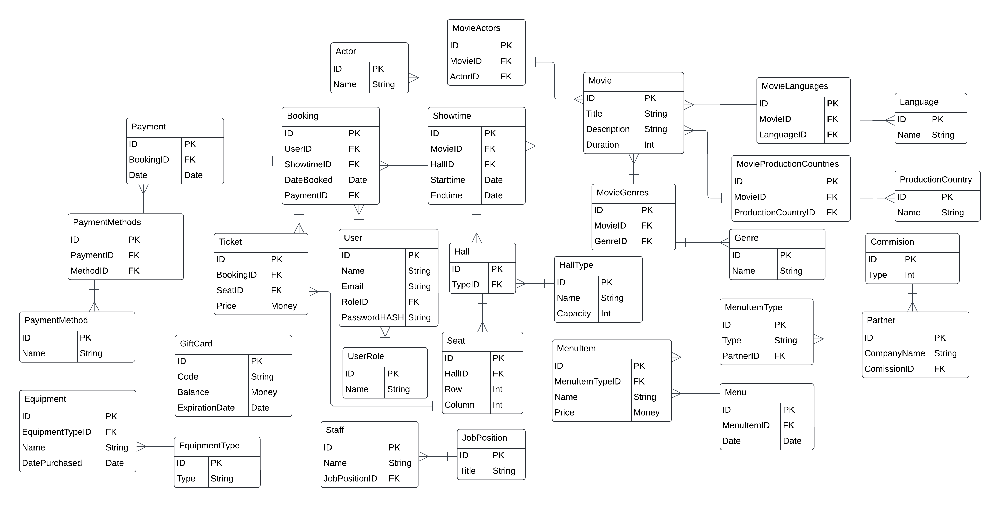

# Database Schema

# Scripts

- [Database creation](https://github.com/naiderrp/Cinema-Database/blob/main/scripts/create-db.md)
- [Fill with data](https://github.com/naiderrp/Cinema-Database/blob/main/scripts/fill-with-data.md)
- [Useful queries](https://github.com/naiderrp/Cinema-Database/blob/main/scripts/queries-pool.md)
